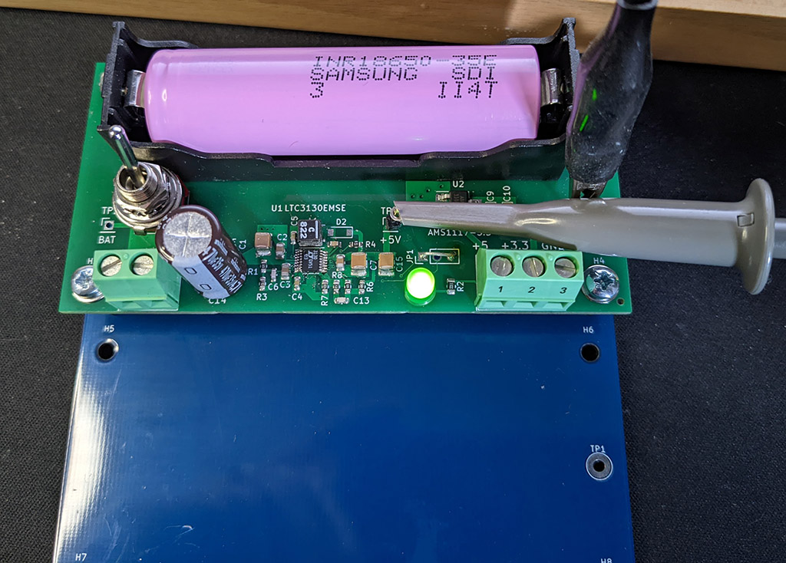

# MaxPower
MaxPower is a dual output buck/boot converter based on the LTC3130. Input power is from an on-board 18650 cell.
Maximum output current is 600mA.  
As shown outputs are 5V and 3.3V. Other voltage pairs are possible.  
An on-board chager is new for version 0.3. The charger is based on the [TP4056](https://jlcpcb.com/partdetail/17264-TP4056_42ESOP8/C16581), a constant-current/constant-voltage charge for a single LiIon battery. Charge current is set by R9. The default 2K gives about 580mA. The chip is rated to 1A, but I doubt the small PCB heatsink is large enough for 1A operation. Constant voltage operation starts when the battery reaches 4.2V. Charge terminates at C/10, about 58mA with R9 set to 2K. 
Charger absolute maxium input is 8VDC. 5V is a reasonable input voltage. 
The manufacturer datasheet and webpage for the TP4056 are in Chinese. I used Google Translate. I later found a third-party translation of the datasheet which you will find in the Datasheets folder.  
:warning: **There is no reverse polarity protection** Putting the battery in backwards will destroy the TP456.  
The external power input can only charge the battery. A TP4056 by itself can not properly charge a battery under load. Switch SW1 ensures the battery charger is only connected when the supply is off.   
:warning: The files embodied in this repository are provided to you "as-is" and without warranty of any kind, express, implied or otherwise, including without limitation, any warranty of fitness for a particular purpose. See section 5 of the license.  
**This fork is untested.** 

### License
[CC BY-NC 4.0](LICENSE.md)

